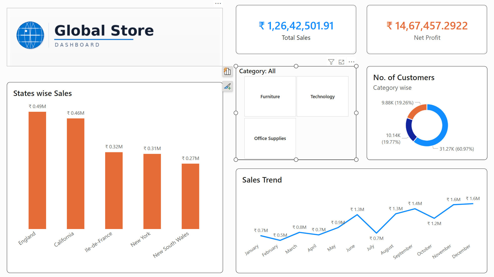

# 🌐 Global Store — Power BI Dashboard



---

## 📊 Project Overview

**Global Store Dashboard** is an interactive Power BI report that provides a comprehensive overview of global retail performance. It enables business stakeholders to monitor sales, profitability, customer distribution, and regional trends — all in one place.

---

## 📁 Folder Structure

```
Global Superstore/
│
├── Dashboard.png            # Screenshot of the Power BI Dashboard
├── Global Store.pbix        # Power BI Desktop project file
├── Global Superstore.xls    # Raw data source (Excel format)
├── Global Superstore.xlsx   # Cleaned/updated data source (Excel format)
└── README.md                # Project documentation (this file)
```

---


## 📈 Key Metrics & Visuals

| Visual | Description |
|---|---|
| 💰 **Total Sales** | ₹ 1,26,42,501.91 — Overall revenue generated |
| 📉 **Net Profit** | ₹ 14,67,457.29 — Profit after all deductions |
| 🗺️ **States wise Sales** | Bar chart showing top 5 states: England, California, Île-de-France, New York, New South Wales |
| 🧩 **Category Filter** | Slicer to filter by Furniture, Technology, and Office Supplies |
| 🍩 **No. of Customers (Category wise)** | Donut chart — Office Supplies (60.97%), Technology (19.77%), Furniture (19.26%) |
| 📅 **Sales Trend** | Monthly line chart showing sales movement across Jan–Dec |

---

## 🗂️ Data Source

- **File:** `Global Superstore.xlsx` / `Global Superstore.xls`
- **Type:** Retail transactional data
- **Covers:** Orders, customers, sales, profit, categories, regions/states

---

## 🛠️ Tools & Technologies

- **Power BI Desktop** — Report development & data modelling
- **Microsoft Excel** — Raw data source
- **DAX** — Calculated measures (Total Sales, Net Profit, Customer Count)
- **Power Query** — Data transformation and cleaning

---

## 🚀 How to Open the Project

1. Install [Power BI Desktop](https://powerbi.microsoft.com/desktop/) (free).
2. Clone or download this repository.
3. Open `Global Store.pbix` in Power BI Desktop.
4. If prompted, update the data source path to point to `Global Superstore.xlsx`.
5. Click **Refresh** to reload the data.

---

## 📌 Features

- ✅ KPI Cards for Total Sales and Net Profit
- ✅ Interactive category slicer (Furniture / Technology / Office Supplies)
- ✅ State-wise sales bar chart (Top 5 regions)
- ✅ Customer distribution donut chart
- ✅ Monthly Sales Trend line chart
- ✅ Clean, branded layout with Global Store identity

---

## 👤 Author

**Devan Patel**
- 📍 Navsari, Gujarat, India
- 🗓️ Project Date: May 2026

---

## 📄 License

This project is for educational and portfolio purposes only. Data sourced from the publicly available Global Superstore dataset.